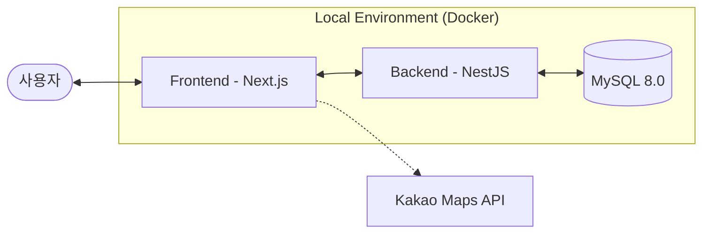
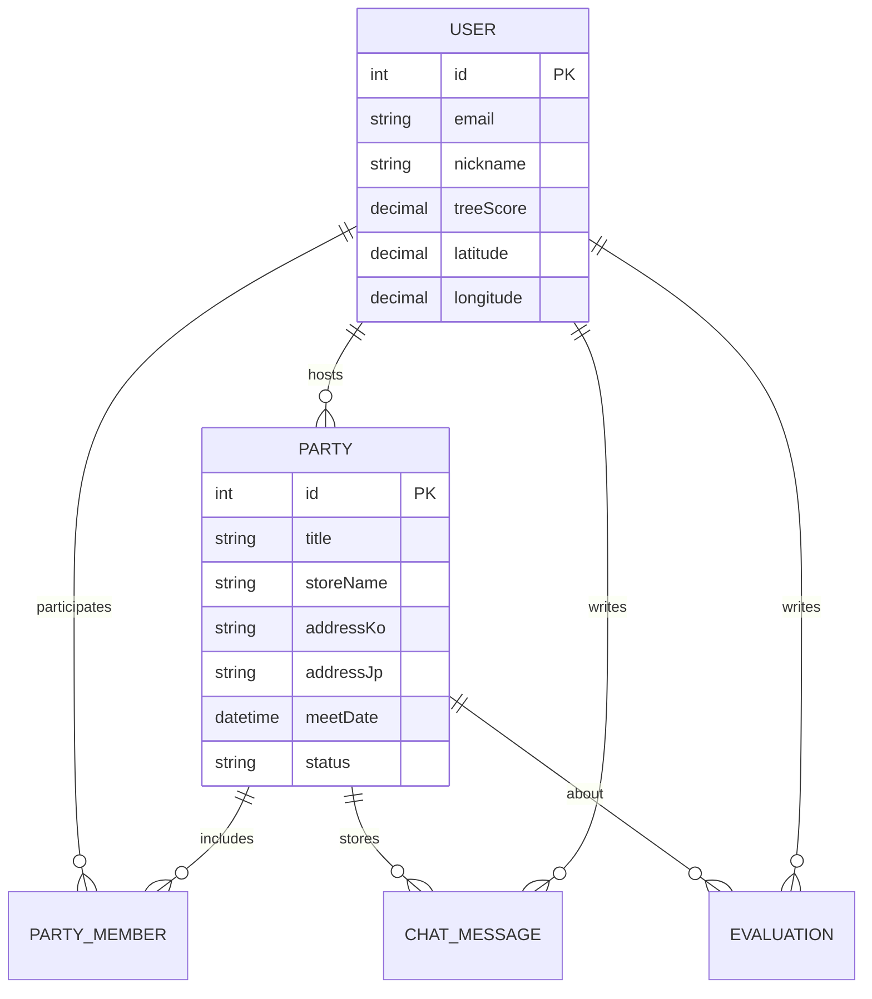

# 🛒 가치무라 (Gachimura)
> **"함께 장보고, 정산은 똑똑하게."**  
> 대용량 마트 상품이 부담스러운 이웃들을 위한 공동 구매 및 스마트 정산 플랫폼

<div align="center">
  
</div>

<br />

<div align="center">
  
  
  
  
  
  
</div>

---

## 📖 프로젝트 개요 (Overview)
**가치무라**는 코스트코, 이마트 트레이더스와 같은 창고형 할인매장의 대용량 상품을 근처 이웃과 함께 나누고 비용을 자동으로 계산해주는 서비스입니다. 지도 기반의 모임 탐색과 실시간 채팅, 그리고 투명한 정산 시스템을 통해 경제적이고 즐거운 장보기 문화를 지향합니다.

---

## 🏗 시스템 아키텍처 (System Architecture)

가치무라는 **Docker Compose**를 기반으로 컨테이너화된 환경에서 동작하며, 서비스 간의 독립성을 보장합니다.



---

## � 프로젝트 구조 (Directory Structure)

### 📦 Root
```bash
.
┣ 📂 backend          # NestJS 기반 API 서버
┣ 📂 frontend         # Next.js 기반 클라이언트 앱
┣ 📜 docker-compose.yml # 테이너 오케스트레이션 설정
┗ 📜 README.md         # 프로젝트 가이드
```

### 📂 Backend
```bash
./backend/src
┣ 📂 auth            # JWT 기반 인증 및 소셜 로그인 로직
┣ 📂 parties         # 모임 생성, 상세조회, 검색 및 필터링
┣ 📂 party-members   # 모임 참가 및 멤버 상태 관리
┣ 📂 chat            # Socket.io 기반 실시간 채팅 통신
┣ 📂 chat-message    # 채팅 로그 데이터베이스 관리
┣ 📂 reviews         # 유저 상호 평가 및 신뢰 지수(treeScore) 시스템
┣ 📂 users           # 사용자 프로필 및 위치 정보 관리
┗ 📂 database/seeds  # 초기 데이터 구성을 위한 시딩 스크립트
```

### 📂 Frontend
```bash
./frontend
┣ 📂 app             # Next.js App Router 기반 페이지 구성
┃ ┣ 📂 (main)        # 로그아웃 상태의 랜딩 페이지
┃ ┣ 📂 (searchbarLayout) # 검색바가 포함된 대시보드 구조
┃ ┣ 📂 (titleLayout)  # 타이틀 위주의 단순 페이지 레이아웃
┃ ┗ 📂 (userLayout)   # 사용자 프로필 관련 페이지
┣ 📂 components      # UI 라이브러리 및 도메인별 컴포넌트
┣ 📂 public          # 로고, 정적 이미지 등 에셋
┗ 📂 constants       # 다국어 설정(menu.ts) 및 공통 상수
```

---

## ✨ 핵심 기능 (Key Features)

### 1️⃣ 위치 기반 모임 탐색
- **하버사인 공식**: 사용자 좌표 기준 10km 이내 모임 자동 분류 및 우선 노출.
- **실시간 위치 갱신**: Geolocation API와 Kakao Geocoder를 통한 동네 인증.
- **Bilingual Address**: 한/일 다국어 상세 주소 지원.

### 2️⃣ 실시간 커뮤니케이션
- **Socket.io**: 지연 없는 실시간 채팅방 및 수락/거절 알림.
- **참여 관리**: 방장의 승인 프로세스를 통한 안전한 이웃 모집.

### 3️⃣ 신뢰 지수 시스템 (treeScore)
- **가치 실천도**: 모임 참여 후 상호 평가를 통한 신뢰 기반 커뮤니티 조성.
- **호스트 보너스**: 모임 개설 및 운영 기여도에 따른 추가 점수 로직.

---

## 📊 데이터베이스 설계 (ER Diagram)



---

## ⚙️ 실행 방법 (Local Setup)

### Docker 사용 (권장)
```bash
docker-compose up --build
```

### Manual 실행
- **Backend**: `cd backend && npm install && npm run start:dev`
- **Frontend**: `cd frontend && npm install && npm run dev`

---

## 👥 팀 정보 (Team)
- **Team Greenora**
- © 2026 All Rights Reserved.
